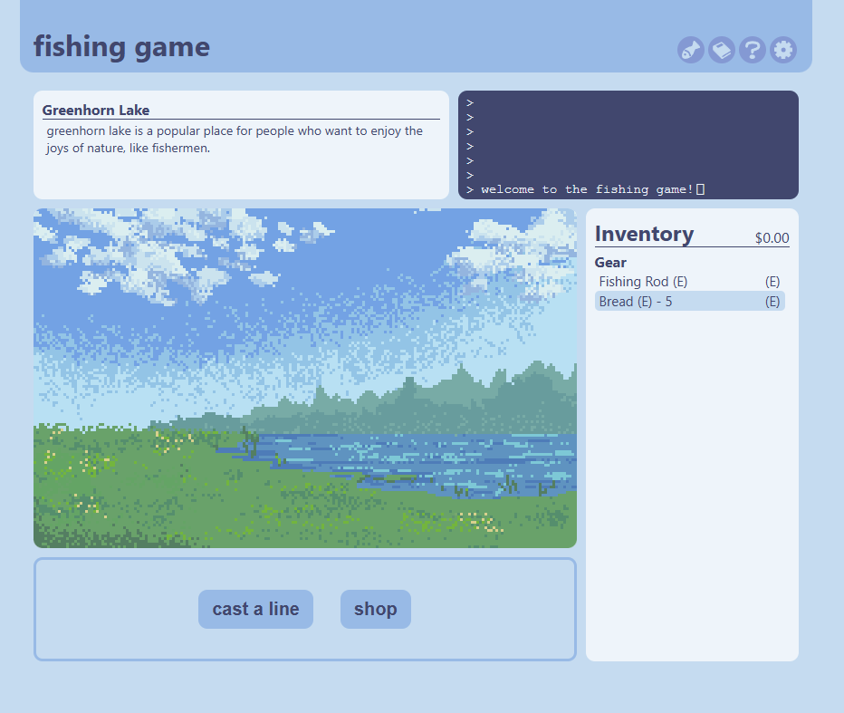

# Fishing Game

This is a webpage experience made entirely with React. You can play it [here](https://ja9q.github.io/fish/).
(Please note that the backend is currently hosted on a service that spins down with inactivity. Certain actions may take several minutes in such cases.)

You are a person who decided to go fishing one day. You can catch fish and sell them - all so you can upgrade your gear and explore the world to catch even more fish.